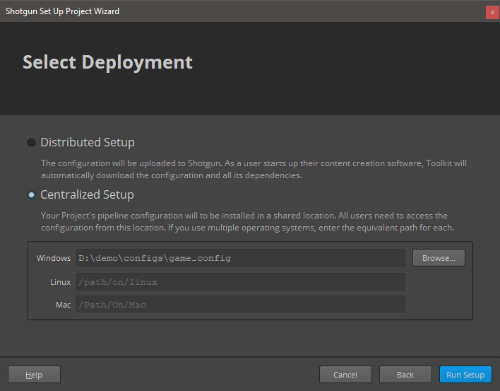
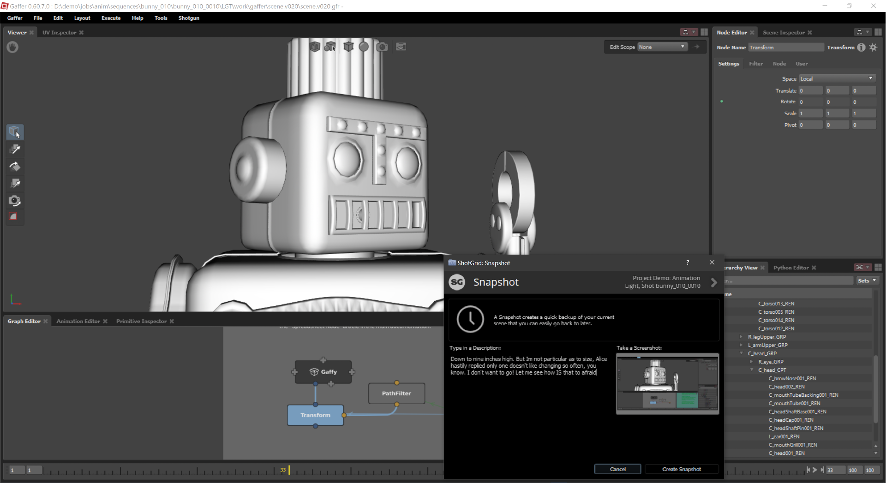

# Shotgun toolkit engine for Gaffer

Contact : [Diego Garcia Huerta](https://www.linkedin.com/in/diegogh/)


## Overview

Implementation of a shotgun engine for [**Gaffer**](https://www.gafferhq.org/). It supports the classic bootstrap startup methodology and integrates with Gaffer adding a new Shotgun Menu in the main Gaffer tool-bar.

* [Engine Installation](#engine-installation)
* [Configuring your project for Shotgun Toolkit](#configuring-your-project-for-shotgun-toolkit)
* [Modifying the toolkit configuration files to add this engine and related apps](#modifying-the-toolkit-configuration-files-to-add-this-engine-and-related-apps)
* [Modifying the Templates](#modifying-the-templates)
* [Modifying the directory schema](#modifying-the-directory-schema)
* [Configuring Gaffer in the software launcher](#configuring-gaffer-in-the-software-launcher)
* [Caching and downloading the engine into disk](#caching-and-downloading-the-engine-into-disk)
* [Gaffer engine should be ready to use](#gaffer-engine-should-be-ready-to-use)
* [Toolkit Apps Included](#toolkit-apps-included)

With the engine, hooks for most of the standard tk applications are provided:

* [tk-multi-workfiles2](#tk-multi-workfiles2)
* [tk-multi-snapshot](#tk-multi-snapshot)
* [tk-multi-loader2](#tk-multi-loader2)
* [tk-multi-publish2](#tk-multi-publish2)
* [tk-multi-breakdown](#tk-multi-breakdown)
* [tk-multi-setframerange](#tk-multi-setframerange)

More:

* [Gaffer engine options](#gaffer-engine-options)
* [Development notes](#development-notes)

**Disclaimer**

**This engine has been developed and tested in Windows 10 using Gaffer version 0.59.0**
You can find this the port to windows in [Eric Mehl](https://www.linkedin.com/in/ericmehl/) github Gaffer repository:
[Gaffer Windows](https://github.com/hypothetical-inc/gaffer/releases)

The engine has not been used in production before so **use it at your own risk**. Also keep in mind that some of the hooks provided might need to be adapted to your work flows and pipelines. If you use it in production, I would love to hear about it, drop me a message in the contact link at the top of this documentation.

## Engine Installation

When I started using shotgun toolkit, I found quite challenging figuring out how to install and configure a new tk application or a new engine. Shotgun Software provides extensive documentation on how to do this, but I used to get lost in details, specially with so many configuration files to modify.

If you are familiar with how to setup an engine and apps, you might want to skip the rest of this document, just make sure to check the [templates](config/core/templates.yml) and [additions to the configs](config/env) that might give you a good start.
Also be sure tocheck  the options available for this engine here:

 [Gaffer engine options](#gaffer-engine-options)

If you are new to shotgun, I also recommend to read at least the following shotgun articles, so you get familiar with how the configuration files are setup, and the terminology used:

* [App and Engine Configuration Reference](https://support.shotgunsoftware.com/hc/en-us/articles/219039878-App-and-Engine-Configuration-Reference)
* [Overview of Toolkit's New Default Configuration](https://support.shotgunsoftware.com/hc/en-us/articles/115004077494-Overview-of-Toolkit-s-New-Default-Configuration-)

Here are detailed instructions on how to make this engine work assuming you use a standard shotgun toolkit installation and have downloaded shotgun desktop.

[Shotgun Desktop Download Instructions](https://support.shotgunsoftware.com/hc/en-us/articles/115000068574#Getting%20started%20with%20Shotgun%20Desktop)

Also an amazing resource to look for help when configuring your engine, is the [Shotgun Community Forums](https://community.shotgunsoftware.com/), specifically under *Pipeline Integrations* category.

Finally, this link contains the technical reference for Shotgun toolkit and related technologies, a great effort to collate all the tech documentation in a single place:

[Shotgun's Developer Documentation](https://developer.shotgunsoftware.com/)

## Configuring your project for Shotgun Toolkit

If you haven't done it yet, make sure you have gone through the basic steps to configure your project to use shotgun toolkit, this can be done in shotgun desktop app, by:

* enter into the project clicking it's icon

* click on the user icon to show more options (bottom right)

* click on *Advanced project setup*

    

* *Select a configuration*: "Shotgun Default" or pick an existing project that you have already setup pages and filters for.


* *Select a Shotgun Configuration*: select "default" which will download the standard templates from shotgun. (this documentation is written assuming you have this configuration)


* *Define Storages*: Make sure you name your first storage "primary", and a choose a primary folder where all the 'jobs' publishes will be stored, in this case "D:\demo\jobs" for illustrative purposes.


* *Project Folder Name*: This is the name of the project in disk. You might have some sort of naming convention for project that you might follow, or leave as it is. (My advice is that you do not include spaces in the name)


* *Select Deployment*: Choose "Centralized Setup". This will be the location of the configuration files (that we will be modifying later). For example, you could place the specific configuration for a project (in this example called game_config) within a folder called "configs" at the same level then the jobs folder, something like:

```shell
├───jobs
└───configs
    └───game_config
        ├───cache
        ├───config
        │   ├───core
        │   │   ├───hooks
        │   │   └───schema
        │   ├───env
        │   │   └───includes
        │   │       └───settings
        │   ├───hooks
        │   │   └───tk-multi-launchapp
        │   ├───icons
        │   └───tk-metadata
        └───install
            ├───apps
            ├───core
            ├───engines
            └───frameworks
```

(Note that this might not be suitable for more complex setups, like distributed configurations)


## Modifying the toolkit configuration files to add this engine and related apps

Every pipeline configuration has got different environments where you can configure apps accordingly. (for example you might want different apps depending if you are at an asset context or a shot context. The configured environments really depend on your projects requirements. While project, asset, asset_step, sequence, shot, shot_step, site are the standard ones, it is not uncommon to have a sequence_step environment or use a episode based environment either.

I've included a folder called 'config' in this repository where you can find the additions to each of the environments and configuration YAML files that come with the [default shotgun toolkit configuration repository](https://github.com/shotgunsoftware/tk-config-default2) (as of writing)

[configuration additions](config)

These YAML files provided **should be merged with the original ones as they won't work on their own.**

As an example, for the location of the engine, we use a git descriptor that allows up to track the code from a git repository. This allows easy updates, whenever a new version is released. So in the example above, you should modify the file:
``.../game_config/config/env/includes/engine_locations.yml``

and add the following changes from this file:
[engine_locations.yml](config/env/includes/engine_locations.yml)

```yaml
# Gaffer
engines.tk-gaffer.location:
  type: git
  branch: master
  path: https://github.com/diegogarciahuerta/tk-gaffer.git
  version: v1.0.0
```

**Do not forget to update the version of the engine to the latest one. You can check here which one is the [latest version](https://github.com/diegogarciahuerta/tk-gaffer/releases)**

In your environments you should add tk-gaffer yml file, for example in the asset_step yml file:
``/configs/game_config/env/asset_step.yml``

Let's add the include at the beginning of the file, in the 'includes' section:

```yaml
- ./includes/settings/tk-gaffer.yml
```

Now we add a new entry under the engines section, that will include all the information for our Gaffer application:

```yaml
  tk-gaffer: "@settings.tk-gaffer.asset_step"
```

And so on.

Finally, do not forget to copy the additional `tk-gaffer.yml` into your settings folder.

## Modifying the Templates

The additions to `config/core/templates.yml` are provided also under the config directory of this repository, specifically:

[templates.yml](config/core/templates.yml)

## Modifying the Directory Schema

Also I have decided to configure the `sequence_step` environment for this engine, so there are additions to the directory structure schema that might need to be added if you are not already using that environment. (note that they follow the standard schema setup from shotgun and might need to be adjusted to your pipeline needs)

[directory schema additions](config/core/schema)


## Configuring Gaffer in the software launcher

In order for our application to show up in the shotgun launcher, we need to add it to our list of software that is valid for this project.

* Navigate to your shotgun URL, ie. `example.shotgunstudio.com`, and once logged in, clink in the Shotgun Settings menu, the arrow at the top right of the web page, close to your user picture.
* Click in the Software menu


* We will create a new entry for Gaffer, called "Gaffer" and whose description can be conveniently copy and pasted from the [Gaffer website](https://gaffer-animation.com/)


* We now should specify the engine this software will use. "tk-gaffer"


* Note that you can restrict this application to certain projects by specifying the project under the projects column. If no projects are specified this application will show up for all the projects that have this engine in their configuration files.

If you want more information on how to configure software launches, here is the detailed documentation from shotgun.

[Configuring software launches](https://support.shotgunsoftware.com/hc/en-us/articles/115000067493#Configuring%20the%20software%20in%20Shotgun%20Desktop)

## Caching and downloading the engine into disk

One last step is to cache the engine and apps from the configuration files into disk. Shotgun provides a tank command for this.

[Tank Advanced Commands](https://support.shotgunsoftware.com/hc/en-us/articles/219033178-Administering-Toolkit#Advanced%20tank%20commands)

* Open a console and navigate to your pipeline configuration folder, where you will find a `tank` or `tank.bat` file.
(in our case we placed the pipeline configuration under `D:\demo\configs\game_config`)

* type `tank cache_apps` , and press enter. Shotgun Toolkit will start revising the changes we have done to the configuration YAML files and downloading what is requires.


## Gaffer engine should be ready to use

If we now go back and forth from our project in shotgun desktop ( < arrow top left if you are already within a project ), we should be able to see Gaffer as an application to launch.


## Gaffer engine options

`GAFFER_BIN_DIR`: defines where the gaffer executable directory is. This is used in case you decide to install Gaffer in a different location than the default. Note that the toolkit official way to achieve the same is by using [tk-multi-launchapp](https://github.com/shotgunsoftware/tk-multi-launchapp), but for less complicated cases, this environment variable should be sufficient.

`SGTK_GAFFER_CMD_EXTRA_ARGS`: defines extra arguments that will be passed to executable when is run.

[Command Line reference](https://www.gafferhq.org/documentation/0.59.0.0/Reference/CommandLineReference/index.html)

## Toolkit Apps Included

## [tk-multi-workfiles2](https://support.shotgunsoftware.com/hc/en-us/articles/219033088)


This application forms the basis for file management in the Shotgun Pipeline Toolkit. It lets you jump around quickly between your various Shotgun entities and gets you started working quickly. No path needs to be specified as the application manages that behind the scenes. The application helps you manage your working files inside a Work Area and makes it easy to share your work with others.

Basic [hooks](hooks/tk-multi-workfiles2) have been implemented for this tk-app to work. open, save, save_as, reset, and current_path are the scene operations implemented.

Check the configurations included for more details:

[additions to the configs](config/env)

## [tk-multi-snapshot](https://support.shotgunsoftware.com/hc/en-us/articles/219033068)


A Shotgun Snapshot is a quick incremental backup that lets you version and manage increments of your work without sharing it with anyone else. Take a Snapshot, add a description and a thumbnail, and you create a point in time to which you can always go back to at a later point and restore. This is useful if you are making big changes and want to make sure you have a backup of previous versions of your scene.

[Hook](hooks/tk-multi-snapshot/scene_operation_tk-gaffer.py) is provided to be able to use this tk-app, similar to workfiles2.

## [tk-multi-loader2](https://support.shotgunsoftware.com/hc/en-us/articles/219033078)


The Shotgun Loader lets you quickly overview and browse the files that you have published to Shotgun. A searchable tree view navigation system makes it easy to quickly get to the task, shot or asset that you are looking for and once there the loader shows a thumbnail based overview of all the publishes for that item. Through configurable hooks you can then easily reference or import a publish into your current scene.

[Hook](hooks/tk-multi-loader2/tk-gaffer_actions.py) for this tk app supports any PublishedFile with an extenstion that a Scene Reader or Image Reader nodes support. For example Alembic Caches, USD, EXR or any other common image formats.

## [tk-multi-publish2](https://support.shotgunsoftware.com/hc/en-us/articles/115000097513)


The Publish app allows artists to publish their work so that it can be used by artists downstream. It supports traditional publishing workflows within the artist’s content creation software as well as stand-alone publishing of any file on disk. When working in content creation software and using the basic Shotgun integration, the app will automatically discover and display items for the artist to publish. For more sophisticated production needs, studios can write custom publish plugins to drive artist workflows.

The basic publishing of the current session is provided as [hooks](hooks/tk-multi-publish2/basic) for this app.

## [tk-multi-breakdown](https://support.shotgunsoftware.com/hc/en-us/articles/219032988)


The Scene Breakdown App shows you a list of items you have loaded in your script and tells you which ones are out of date. Scene reader and Image reader nodes are scanned for file paths that represent published files. Updating those nodes with newer versions of the publishes is supported by this engine.

[Hook](hooks/tk-multi-breakdown/tk-gaffer_scene_operations.py) is provided to display and update the items in teh Gaffer script that represent publishes.

## [tk-multi-setframerange](https://support.shotgunsoftware.com/hc/en-us/articles/219033038)


This is a simple yet useful app that syncs your current file with the latest frame range in Shotgun for the associated shot. If a change to the cut has come in from editorial, quickly and safely update the scene you are working on using this app. Towards the end, it will display a UI with information about what got changed.

[Hook](hooks/tk-multi-setframerange/frame_operations_tk-gaffer.py) is provided to set the frame range for the current Gaffer script for a *shot_step* environment.

As always, please adjust this logic accordingly to however you want to handle frame ranges in your pipeline.

## Development notes

The way this engine works is via a [Gaffer script](startup/gaffer/gui/shotgun_bridge.py) that is run as soon as Gaffer initializes and triggers the instancing of the Gaffer toolkit engine. Once the engine is up and running, the [menus](python/tk_gaffer/menu_generation.py) are created using Gaffers `MenuDefinition` functionality.

A few tricks are used to display the menu in the correct way. Gaffer is a multi document application, you can have multiple gaffer scripts opened at the same time from a single Gaffer python instance, which made a bit complicated the management of the engine context. Context is swapped to the corresponding one (if appropiate) when the menu button is clicked, which could show as a really small delay for the menu to show.

Also at Gaffer startup, there is a chance that a user could click in the menu while the engine is still loaded. This is resolved by showing a temporary menu indicating that the engine is still loading and then showing the real menu after this has finished loading.

Gaffer seems to be compiled with the minimum amount of python standard libraries, which made development of this engine quite complicated at first. Shotgun Toolkit makes uses of the standard library sqlite3, but unfortunately it was not included in the default distribution of Gaffer 0.57.x<0.60.x, at the very least in Windows. I resorted to recompiling it and including it in the repo, although ideally Gaffer python distribution is complete and there is no need for this workaround. As of version 0.60.7.0 this seems to be resolved and the import works as expected, I left the aforementioned functionality just in case anyone is using earlier versions of Gaffer Windows.

Thanks to [Eric Mehl](https://www.linkedin.com/in/ericmehl/) (and the other people involved) for the massive effort that might have been porting Gaffer to Windows. He was the one that put me in the right track with sqlite3, which for the longest was the main blocker for this engine to exist.


[Gaffer Community](https://www.gafferhq.org/community/)

***

For completion, I've kept the original README from shotgun, that include very valuable links:

## Documentation
This repository is a part of the Shotgun Pipeline Toolkit.

- For more information about this app and for release notes, *see the wiki section*.
- For general information and documentation, click here: https://support.shotgunsoftware.com/entries/95441257
- For information about Shotgun in general, click here: http://www.shotgunsoftware.com/toolkit

## Using this app in your Setup
All the apps that are part of our standard app suite are pushed to our App Store.
This is where you typically go if you want to install an app into a project you are
working on. For an overview of all the Apps and Engines in the Toolkit App Store,
click here: https://support.shotgunsoftware.com/entries/95441247.

## Have a Question?
Don't hesitate to contact us! You can find us on support@shotgunsoftware.com
